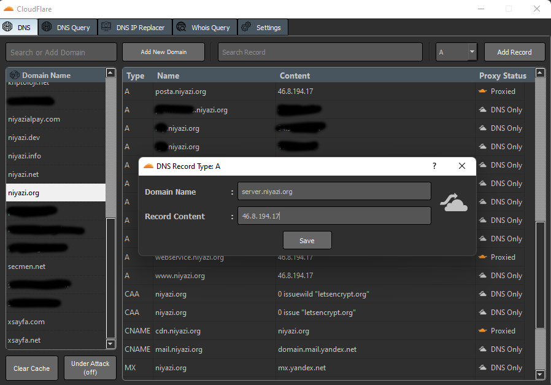
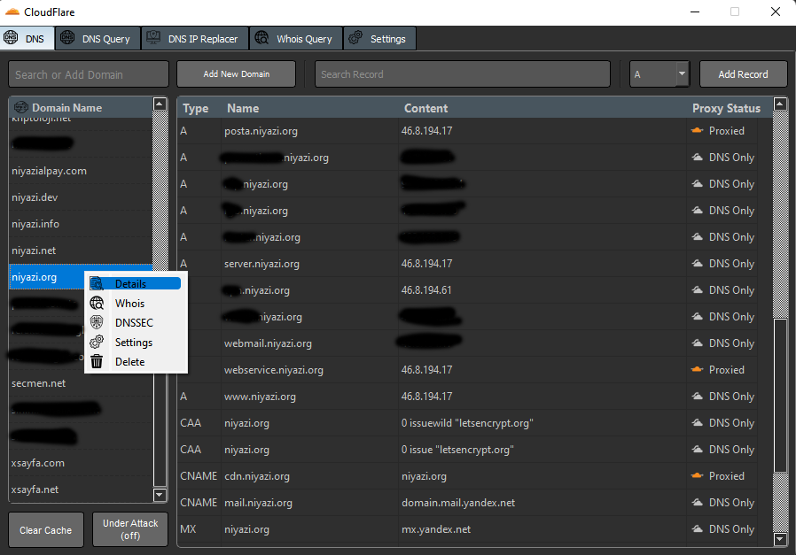
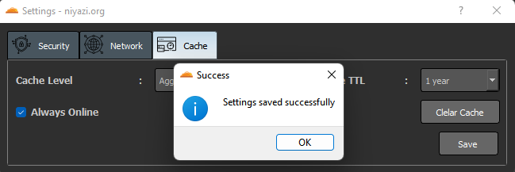
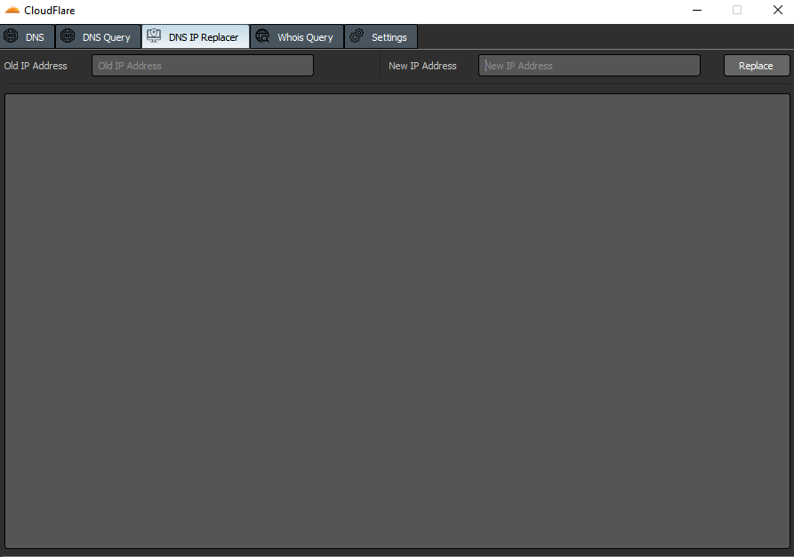

You can manage your DNS settings on CloudFlare, add a new domain, or remove domain. Add, delete or edit DNS records. Most importantly, you can change the IP addresses of all domains at once.

## Screenshots

